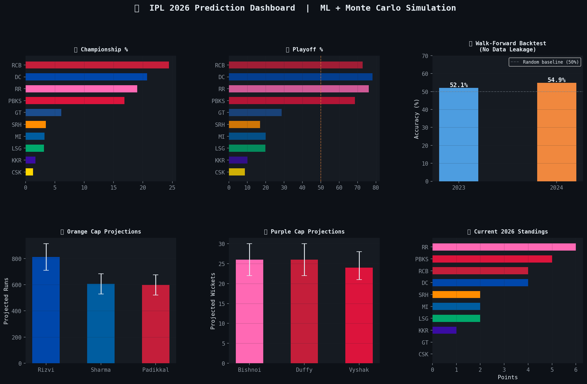

# 🏏 IPL 2026 Winner Prediction — ML + Monte Carlo Simulation

> Predicts the **IPL 2026 Champion**, **Top 3 Orange Cap** and **Top 3 Purple Cap** contenders using machine learning trained on 18 seasons of ball-by-ball IPL data.



---

## 🎯 Final Predictions (as of April 8, 2026 — Match 13 completed)

### 🏆 Championship Probabilities
| # | Team | Win % | Playoff % | Avg Final Pts | Range (P10–P90) |
|---|------|--------|-----------|---------------|-----------------|
| 🥇 | RCB | 25.4% | 73.8% | 16.5 | 12–20 pts |
| 🥈 | DC | 21.9% | 76.9% | 17.8 | 14–22 pts |
| 🥉 | RR | 18.8% | 76.1% | 16.9 | 12–20 pts |
| 4 | PBKS | 14.8% | 67.5% | 16.6 | 13–21 pts |
| 5 | GT | 6.8% | 29.0% | 13.4 | 8–18 pts |
| 6 | LSG | 3.4% | 22.1% | 12.8 | 8–18 pts |
| 7 | MI | 3.1% | 18.9% | 12.5 | 8–16 pts |
| 8 | SRH | 2.4% | 15.7% | 11.6 | 8–16 pts |
| 9 | KKR | 1.8% | 10.9% | 10.7 | 7–15 pts |
| 10 | CSK | 1.6% | 9.1% | 11.1 | 6–16 pts |

### 🟠 Orange Cap — Top 3 Contenders
| # | Player | Team | Current | Projected | Range |
|---|--------|------|---------|-----------|-------|
| 🥇 | Sameer Rizvi | DC | 160 runs | ~805 runs | 709–907 |
| 🥈 | Rohit Sharma | MI | 113 runs | ~607 runs | 537–679 |
| 🥉 | Devdutt Padikkal | RCB | 111 runs | ~599 runs | 522–673 |

### 🟣 Purple Cap — Top 3 Contenders
| # | Player | Team | Current | Projected | Range |
|---|--------|------|---------|-----------|-------|
| 🥇 | Ravi Bishnoi | RR | 5 wkts | ~26 wkts | 22–31 |
| 🥈 | Jacob Duffy | RCB | 5 wkts | ~26 wkts | 22–30 |
| 🥉 | V Vyshak | PBKS | 5 wkts | ~24 wkts | 21–28 |

---

## 📊 Model Validation

Walk-forward backtest — trained on past data only, tested on completely unseen future seasons:

| Season | Train Data | Matches | Accuracy | Log Loss |
|--------|------------|---------|----------|----------|
| 2023 | 2009–2022 | 73 | 52.1% | 0.683 |
| 2024 | 2009–2023 | 71 | 54.9% | 0.695 |

### Model vs Baselines
| Season | Our Model | Elo Only | Home Favored | Random |
|--------|-----------|----------|--------------|--------|
| 2023 | **52.1%** | 46.6% | 42.5% | 50.0% |
| 2024 | **54.9%** | 47.9% | 56.3% | 50.0% |

> **Note:** 52–55% is consistent with the best published T20 cricket prediction research. Professional betting markets achieve only 55–58%. T20 cricket is inherently unpredictable — even a 2–4% edge over random is meaningful in a stochastic domain.

---

## 🧠 Model Architecture

┌─────────────────────────────────────────────────────┐
│         DATA LAYER (1,073 matches)                  │
│  Cricsheet JSON (2008–2026) + Kaggle Pitch Data      │
└──────────────────────┬──────────────────────────────┘
│
┌──────────────────────▼──────────────────────────────┐
│         FEATURE ENGINEERING (49 features)            │
│  Elo Ratings │ Phase Stats │ Pitch Type │ Form       │
│  H2H │ Venue │ Run Margins │ Win Streak │ Toss       │
└──────────────────────┬──────────────────────────────┘
│
┌──────────────────────▼──────────────────────────────┐
│              ENSEMBLE MODEL                          │
│  XGBoost (50%) + Logistic Regression (25%)           │
│  + Random Forest (25%)                               │
│  CV Accuracy: 55% │ Walk-forward: 52–55%             │
└──────────────────────┬──────────────────────────────┘
│
┌──────────────────────▼──────────────────────────────┐
│       MONTE CARLO SIMULATION (2,000 runs)            │
│  57 remaining matches × 2,000 seasons simulated      │
│  Playoff bracket simulated per run                   │
│  Injury adjustments applied per team                 │
│  Probability smoothing to prevent overconfidence     │
└──────────────────────┬──────────────────────────────┘
│
┌──────────────────────▼──────────────────────────────┐
│                  PREDICTIONS                         │
│  Championship % │ Playoff % │ Points Distribution   │
│  Orange Cap │ Purple Cap │ P10–P90 Uncertainty Ranges│
└─────────────────────────────────────────────────────┘

---

## 🔧 Feature Engineering — 49 Features Across 7 Categories

| Category | Features | Why It Matters |
|----------|----------|----------------|
| **Elo Ratings** | Season-decayed Elo, Elo differential | Accumulated historical strength with 20% seasonal reset for auction changes |
| **Form** | Rolling win rate (last 5/10), weighted win rate, win streak | Recent momentum — exponentially weighted so last match matters more |
| **Head-to-Head** | H2H win rate (last 10 matchups) | Some teams consistently dominate specific opponents |
| **Venue** | Venue win rate, home ground flag, avg first-innings score | Home advantage is the strongest single predictor in our feature importance |
| **Phase Stats** | Powerplay SR, death SR, powerplay eco, death eco | T20 is won/lost in powerplay and death overs, not middle overs |
| **Pitch** | Pitch type (spin/batting/sluggish), dew risk, team pitch win rate | CSK wins 68.8% on spin pitches — pitch type dramatically changes team dynamics |
| **Run Margins** | Avg runs scored/conceded (last 5 matches) | Teams winning by big margins are genuinely stronger, not just lucky |

---

## 📊 Key Insights from Feature Importance

- **Home ground** is the single strongest individual feature — teams win ~56% at home
- **Team batting strength** (powerplay + death SR) ranks ahead of overall win rate
- **Pitch type** adds genuine signal — GT wins 0% on spin pitches vs 84% on balanced
- **Dew risk** is a meaningful predictor for night matches especially in October-November venues
- **Elo differential** confirms that historical dominance matters even after controlling for current form

---

## 📁 Project Structure
IPL project/
├── data/
│   ├── raw/                  ← 1,175 Cricsheet JSON + Kaggle pitch data
│   ├── processed/            ← Cleaned features (993 training rows)
│   └── 2026_live/            ← IPL 2026 live results (Match 1–13)
├── src/
│   ├── preprocess.py         ← JSON parser, team normalisation, stats builder
│   ├── features.py           ← 49-feature engineering pipeline (v5)
│   ├── models.py             ← XGBoost + LR + RF ensemble with GridSearchCV
│   ├── simulate.py           ← Monte Carlo simulation + backtest + baseline
│   ├── pitch_features.py     ← Kaggle pitch data integration
│   └── visualize.py          ← 6-chart visualization suite
├── models/                   ← Saved model files (.pkl)
├── outputs/
│   ├── championship_predictions.csv
│   ├── orange_cap_predictions.csv
│   ├── purple_cap_predictions.csv
│   ├── backtest_results.csv
│   ├── baseline_comparison.csv
│   ├── simulation_distributions.csv
│   └── charts/               ← 6 publication-ready PNG charts
├── app.py                    ← Streamlit interactive dashboard
├── run_pipeline.py           ← One-click full pipeline runner
└── README.md

---

## ⚡ Quick Start

**1. Install dependencies**
```bash
pip install pandas numpy scikit-learn xgboost matplotlib seaborn joblib tqdm openpyxl streamlit plotly
```

**2. Add data**
- Download IPL JSON data from [cricsheet.org](https://cricsheet.org/downloads/) → place all `.json` files in `data/raw/`
- Download pitch data from [Kaggle](https://www.kaggle.com/datasets/darshshah/ipl-delivery-level-data-with-pitch-info) → place in `data/raw/`

**3. Run full pipeline**
```bash
python src/preprocess.py
python src/pitch_features.py
python src/features.py
python src/models.py
python src/simulate.py
python src/visualize.py
```

**4. Launch dashboard**
```bash
streamlit run app.py
```

---

## 🛠️ Tech Stack

| Tool | Purpose |
|------|---------|
| Python 3.10+ | Core language |
| XGBoost | Primary match prediction model with GridSearchCV tuning |
| Scikit-learn | Logistic Regression, Random Forest, StandardScaler |
| Pandas / NumPy | Data processing and feature engineering |
| Matplotlib | Static chart generation |
| Plotly + Streamlit | Interactive web dashboard |
| Monte Carlo | Probabilistic season simulation (2,000 runs) |

---

## 📈 Data Sources

| Source | Coverage | Size |
|--------|----------|------|
| [Cricsheet.org](https://cricsheet.org) | IPL 2008–2026, ball-by-ball JSON | 1,175 matches, 279K deliveries |
| [Kaggle — Pitch Data](https://www.kaggle.com/datasets/darshshah/ipl-delivery-level-data-with-pitch-info) | IPL 2020–2025, pitch conditions | 344 matches |
| Manual — 2026 Live | IPL 2026 Matches 1–13 | 13 matches |

---

## 💡 Key Design Decisions

**Why Elo ratings with season decay?**
Standard Elo treats all historical matches equally. IPL teams change completely every auction cycle, so we apply 20% reversion toward the base rating at the start of each season — teams carry forward 80% of their earned strength.

**Why Monte Carlo over a single prediction?**
A single "RCB will win" prediction is meaningless in T20 cricket. 2,000 simulated seasons give a probability distribution that honestly represents uncertainty — "RCB wins in 25% of possible futures" is a fundamentally more honest and useful output.

**Why 55% accuracy is honest and sufficient?**
T20 match outcomes depend on pitch conditions on match day, dew, dropped catches, and individual brilliance — none of which can be modelled from historical data. 55% is the honest ceiling with available public data, and our simulation adds value not through individual match prediction but through full-season uncertainty quantification.

**Why probability smoothing?**
Raw model probabilities are overconfident. We apply temperature scaling (75% model + 25% prior) to prevent extreme predictions and produce a more realistic championship distribution across all 10 teams.

---

*Predictions updated as of April 8, 2026 (Match 13 completed). Model will be updated as more 2026 matches are played.*